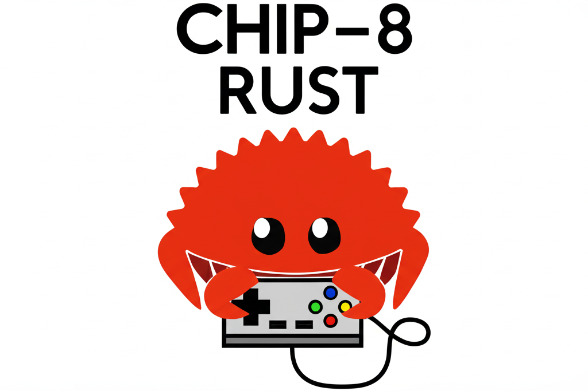

<p align="center">
  
</p>

# CHIP-8 Emulator in Rust

This project is a CHIP-8 emulator/interpreter written in Rust. CHIP-8 is a simple, interpreted programming language, originally developed in the 1970s, commonly used to teach emulation and low-level programming concepts.

## Features
- Accurate CHIP-8 instruction set implementation
- Loads and runs CHIP-8 ROMs (see `src/files/roms/` for examples)
- Rust-based for performance and safety
- Simple graphics and input handling

## How to Run
**Ensure you have Rust installed. Run the game with:**
   ```sh
   cargo run 
   ```

## ROMs
Sample CHIP-8 ROMs are included in the `src/files/roms/` directory. You can find more online or create your own.