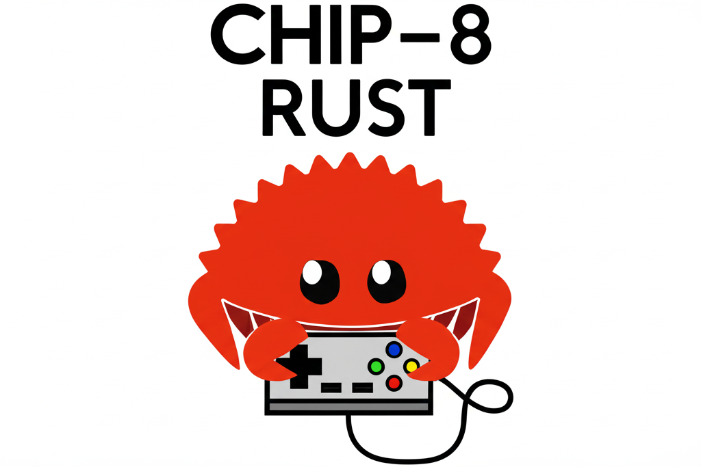
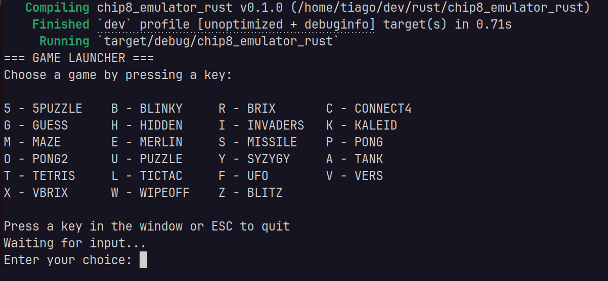

<p align="center">
  
</p>

# CHIP-8 Emulator in Rust

This project is a CHIP-8 emulator/interpreter written in Rust. CHIP-8 is a simple, interpreted programming language, originally developed in the 1970s, commonly used to teach emulation and low-level programming concepts.

> **Inspired by**: This project was motivated by [Austin Henley's "Challenging projects every programmer should try"](https://austinhenley.com/blog/challengingprojects.html), which highlights text editor implementation as one of the most educational programming projects. Building a text editor from scratch teaches fundamental concepts about data structures, cursor behavior, and efficient text manipulation that every programmer should understand.

## Features
- Accurate CHIP-8 instruction set implementation
- Loads and runs CHIP-8 ROMs (see `files/roms/` for examples)
- Rust-based for performance and safety
- Simple graphics and input handling


## How to Run
**Ensure you have Rust installed.**

### Run the Emulator (Normal Mode)
```sh
cargo run
```

#### Select a ROM from the menu:
<p>
  


### Run the Emulator (Debug Mode)
```sh
argo run -- --debug --instruction_count 50 --rom PONG
```

## File Structure

```
chip8_emulator_rust/
├── Cargo.toml            # Main Rust project manifest
├── Cargo.lock            # Cargo lock file
├── README.md             # This documentation file
├── chip8_core/           # Core CHIP-8 emulation logic as a Rust library crate
│   ├── Cargo.toml        # Manifest for the core library
│   └── src/
│       └── lib.rs        # Core CHIP-8 implementation
├── src/                  # Main application source code
│   ├── main.rs           # Entry point for the emulator
│   ├── chip8.rs          # CHIP-8 system and emulation logic
│   ├── chip8_util.rs     # Utility functions for the emulator
│   ├── constants.rs      # Constants used throughout the emulator
│   ├── game_menu.rs      # Game/ROM selection menu logic
│   ├── screen.rs         # Graphics and display handling
│   └── user_input.rs     # Keyboard/input handling
├── files/
│   ├── images/           # Images for documentation or UI (e.g., logo)
│   └── roms/             # Sample CHIP-8 ROMs for testing
│       └── tests/        # Additional test ROMs
└── target/               # Build output (auto-generated by Cargo)
```

### File/Folder Explanations
- **chip8_core/**: Contains the reusable core emulation logic as a library crate.
- **src/**: Main application code, including the emulator entry point and modules for graphics, input, and menus.
- **files/roms/**: Example CHIP-8 ROMs you can run with the emulator.
- **files/images/**: Images used in documentation or the emulator UI.
- **target/**: Build artifacts and compiled binaries (auto-generated).

## ROMs
Sample CHIP-8 ROMs are included in the `files/roms/` directory. You can find more online or create your own.


## Useful Links

- **Chip-8 Technical Reference v1.0**: [http://devernay.free.fr/hacks/chip8/C8TECH10.HTM#2.5](http://devernay.free.fr/hacks/chip8/C8TECH10.HTM#2.5)
- **Mastering Chip-8**: [https://github.com/mattmikolay/chip-8/wiki/Mastering-CHIP%E2%80%908](https://github.com/mattmikolay/chip-8/wiki/Mastering-CHIP%E2%80%908)
- **Test suite**: [https://github.com/Timendus/chip8-test-suite?tab=readme-ov-file](https://github.com/Timendus/chip8-test-suite?tab=readme-ov-file)
- **An Introduction to Chip-8 Emulation using the Rust Programming Language**: [https://github.com/aquova/chip8-book](https://github.com/aquova/chip8-book)